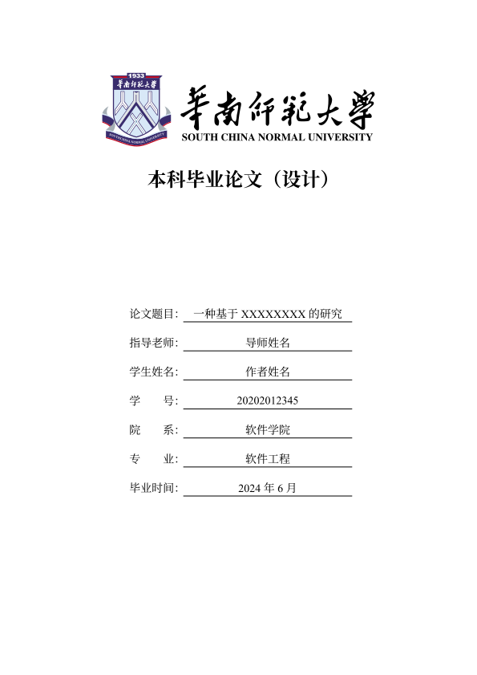
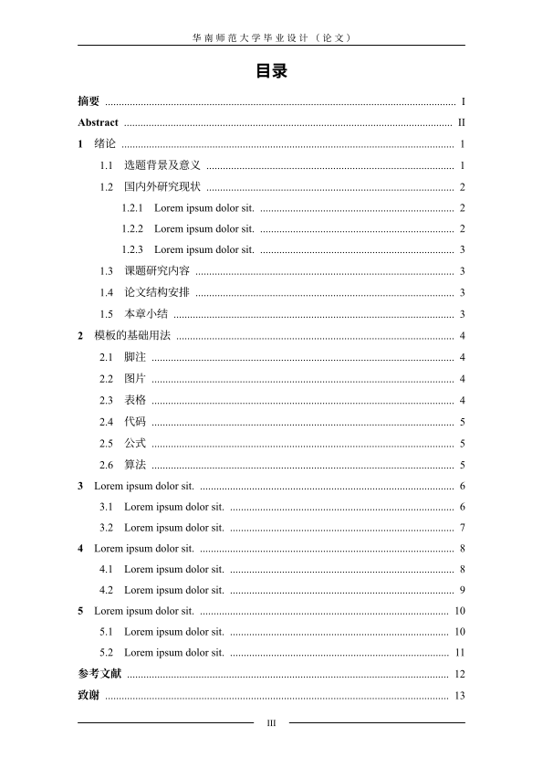
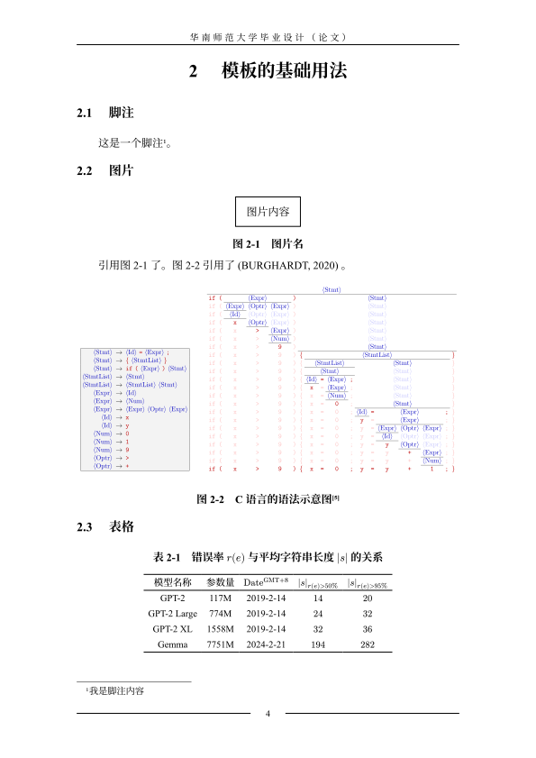
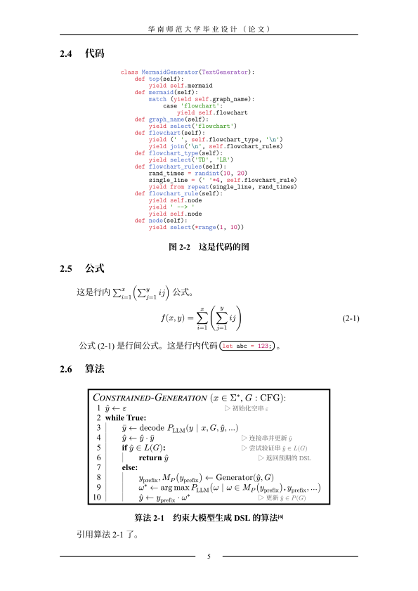
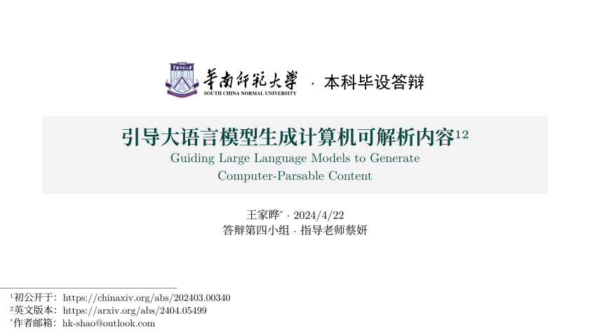
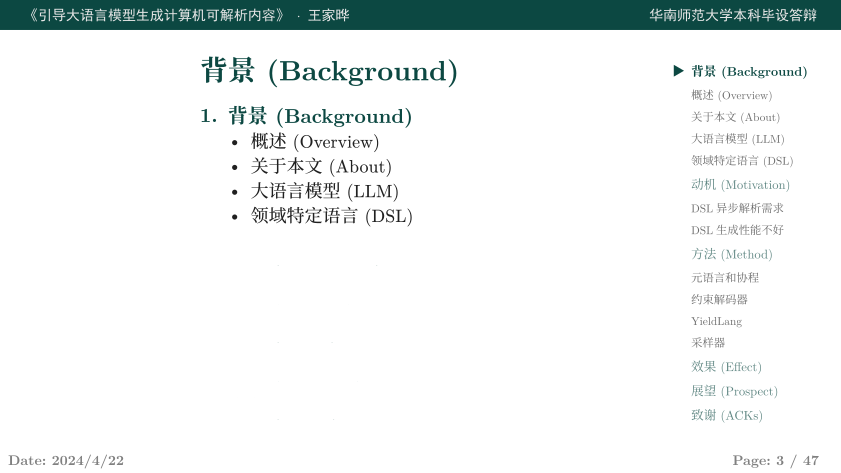
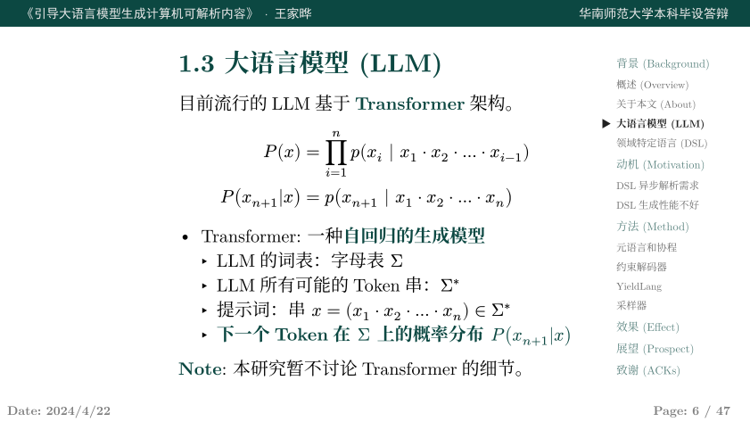
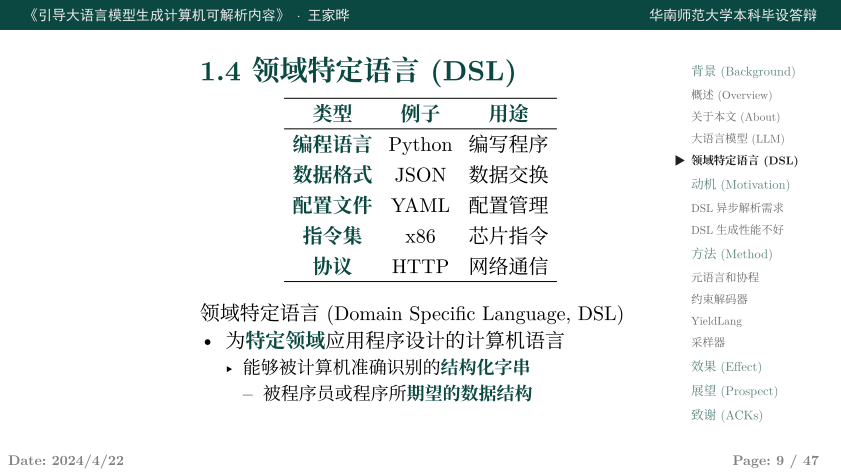

# SCNU-Typst-Template

欢迎给个星星⭐🌟~ 或者 Fork 本仓库。

## 华南师范大学本科毕设（论文）模板

> [!WARNING]
> **请必须知悉这不是官方模板，仅供参考。**
> 每一届、每一个老师可能都会有不同的标准，请务必做好修改本模板以满足上级要求的准备。

本模板从本人文章中提取，可参考预印本预览：
1. arXiv: https://arxiv.org/abs/2404.05499
2. ChinaXiv 中文论文: https://chinaxiv.org/abs/202403.00340
3. ChinaXiv 中文幻灯片: https://chinaxiv.org/abs/202404.00273

## 什么是 Typst

A new markup-based typesetting system that is powerful and easy to learn.

- https://typst.app/
- https://github.com/typst/typst

## 学位论文

> [!NOTE]
> 魔改自：https://github.com/werifu/HUST-typst-template

- 见 `paper.typ`

|  |  |
|:--:|:--:|
|  |  |

## 幻灯片

> [!NOTE]
> 魔改自：https://github.com/touying-typ/touying

- 见 `slides.typ`

|  |  |
|:--:|:--:|
|  |  |

## 广告位

用于引用的 BibTeX 文本:

```bibtex
@misc{wang2024guiding,
      title={Guiding Large Language Models to Generate Computer-Parsable Content}, 
      author={Jiaye Wang},
      year={2024},
      eprint={2404.05499},
      archivePrefix={arXiv},
      primaryClass={cs.SE}
}
```